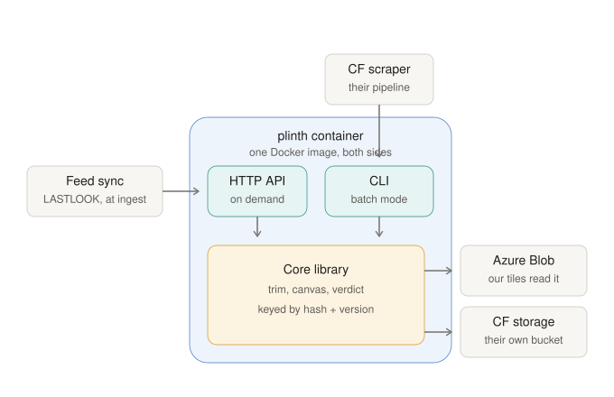
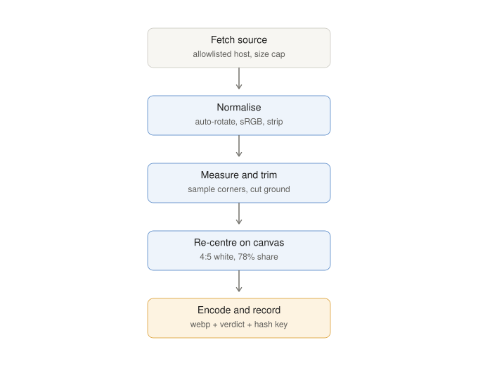

# Plinth — design

*2 September 2026. Status: draft for owner review.*

Plinth puts every product on the same plinth. It takes retailer pack shots
that were photographed at wildly different scales and framings, trims each to
its content, and re-centres it on one canvas so a grid of products from many
sellers reads as one catalogue. It ships as a single open-source container
that LASTLOOK and Click Frenzy (CF) can each run inside their own pipelines.

## 1. Why this exists

LASTLOOK's multi-seller feed mixes pack shots from fifteen retailer CDNs.
The Iconic ships a shoe at 20% of its frame, Amazon at 98%, Myer at 83%.
No amount of tile styling hides that. The image engine on `main` in the
Mahir repo (`lib/image-engine.ts`, `app/img-engine/route.ts`) already
solves it for us as an on-demand Next.js route built on sharp, and it works:
every product whole, centred, same scale, one ground.

CF has the same problem across every seller they scrape and declined to
build it because of compute cost at their scale. That objection comes from
picturing a naive "process everything on every scrape" model. Plinth is
designed so that model never happens: each unique image is processed once,
keyed by content, and never again.

The owner's goal (2 Sep): a shared open-source tool that both sides run
themselves. **No change to the CF feed contract.** CF running it internally
is the win; anything in the feed is out of scope.

## 2. Goals and non-goals

Goals:

- One deterministic core that turns a pack shot into a normalised tile plus
  a result record, identical output for identical input.
- Two thin front doors over that core: an HTTP API for on-demand use and a
  CLI for batch runs at ingest.
- Incremental by construction: outputs are content-addressed, reruns skip
  what exists.
- Safe to expose: allowlisted sources, size and pixel caps, no proxying into
  private networks.
- Replace LASTLOOK's Next.js engine route with the same container, so we
  dogfood exactly what CF would run.

Non-goals for v1:

- No classifier making trim decisions. The pack-shot verdict is **reported**
  on every image; the host allowlist still **decides**.
- No AVIF or per-width resizing. Vercel's image optimiser does that in front
  of us; CF has its own CDN.
- No multi-tenant auth, accounts or quotas.
- No feed changes, no new fields for CF to emit.
- No background removal, recolouring or generative work. The contract leaves
  room for them (see 4.4) but nothing is built.

## 3. Architecture



One repository, MIT licensed, `ollie789/plinth`, public from the first
commit. .NET 10 LTS. Imaging via NetVips, the .NET binding for libvips,
which is the same engine sharp uses, so quality and speed match the current
route. NetVips is MIT; libvips is LGPL and dynamically linked.

Layout:

```
plinth/
  src/Plinth.Core/     pure library: recipe, normalise, verdict, key
  src/Plinth.Pipeline/ fetcher, stores, pipeline orchestration, options
  src/Plinth.Api/      ASP.NET minimal API wrapping Pipeline
  src/Plinth.Cli/      System.CommandLine tool wrapping Pipeline
  src/Plinth.Bench/    fixture benchmark, compares against docs/bench/baseline.json
  tests/Plinth.Tests/  xUnit: golden fixtures, determinism, policy, CLI
  docs/                this spec, diagrams, API and CLI reference
  Dockerfile           one image, entrypoint selects api or cli
  .github/workflows/   build, test, publish image to GHCR on tags
```

`ISourceFetcher` and `IOutputStore` — and everything that implements them —
live in `Plinth.Pipeline`, not `Plinth.Core`: Core stays free of I/O, with no
knowledge of HTTP, files or Azure. Everything that touches the outside world
sits behind two interfaces:

- `ISourceFetcher` — bytes for a URL, under the fetch policy (5.1).
- `IOutputStore` — put and get by key. Implementations: filesystem,
  Azure Blob, in-memory. The API's default is pass-through (no store).

Why a container and not a library: Vercel cannot run .NET in-process, and CF's
stack is unknown. A container with an HTTP interface is the one shape both
can run without caring what is inside.

## 4. The core contract

This is the foundation. Everything else can be rewritten behind it.

### 4.1 Recipe

The small set of choices that define an output. Defaults are today's engine.

| Field | Default | Meaning |
|---|---|---|
| `aspect` | `4:5` | Output canvas ratio |
| `width` | `1000` | Canvas width in px; height follows aspect |
| `contentShare` | `0.85` | The trimmed product is fitted inside a box that is this share of the canvas on both axes (850×1062 on the default canvas) |
| `upscale` | `true` | Allow enlarging small sources to reach the content box (today's behaviour) |
| `background` | `#ffffff` | Canvas ground, also the flatten colour for transparency |
| `trimThreshold` | `12` | Max distance from the sampled ground for a pixel to count as ground |
| `format` | `webp` | `webp` or `png` |
| `quality` | `84` | Encoder quality where the format has one |
| `editorial` | `passthrough` | What to do with an image the verdict says is not a pack shot: `passthrough` returns the source untouched, `card` trims and cards it anyway |

A recipe serialises to canonical JSON (sorted keys, no whitespace) and hashes
to `recipeHash` (first 16 hex of SHA-256).

### 4.2 Key

```
sourceId = canonical URL when the image was fetched
         = "sha256:" + hex(sha256(bytes)) when bytes were supplied directly
key      = sha256( sourceId + "|" + recipeHash + "|" + engineVersion )
```

The key is addressable **from the URL alone**, without fetching. That is
what makes batch reruns free (skip by key, no download) and what lets a
consumer compute an output's location with no lookup table. The record
carries the content hash of the bytes actually processed, so a silent change
behind the same URL is detectable with `--refresh`, and identical images at
different URLs can be deduplicated later by a content-hash index.

`engineVersion` is the **algorithm** version, bumped only when output would
change, not on every package release. Bumping it invalidates every cached
output on purpose; that is the cost of never serving a stale tile. It is a
constant in Core (`Engine.Version`); bump it whenever the pinned libvips
changes or the algorithm changes. The record also carries `libvipsVersion`,
which is not part of the key, so a mismatch between the libvips that produced
an output and the one running now is detectable.

The key is the filename in every store and the cache identity in every URL.

### 4.3 Normalise

```
NormalizeResult Normalize(ReadOnlySpan<byte> source, Recipe recipe)
```

Pure and deterministic: same bytes and recipe produce byte-identical output
and an identical record. No network, no clock, no randomness.

### 4.4 Result record

Emitted for every image, success or failure. Stored beside the output as
`<key>.json`, returned as headers by the API, written to the CLI manifest.

```json
{
  "key": "…",
  "engineVersion": "1.2",
  "libvipsVersion": "8.18.6",
  "recipeHash": "…",
  "source": { "sha256": "…", "bytes": 184233, "width": 1600, "height": 2000, "format": "jpeg", "hadAlpha": false, "orientationApplied": 1 },
  "ground": { "sampled": "#fefefe", "cornerSpread": 2, "cornersAgree": true, "matchesBackground": true },
  "trim": { "left": 310, "top": 120, "width": 980, "height": 1690, "contentShareBefore": 0.61 },
  "verdict": { "packShot": true, "confidence": 0.93, "reasons": [] },
  "output": { "width": 1000, "height": 1250, "bytes": 61240, "format": "webp" },
  "timingsMs": { "inspect": 1, "measure": 6, "decode": 0, "render": 30, "encode": 0, "total": 37 },
  "status": "ok",
  "error": null,
  "passthroughReason": null
}
```

`passthroughReason` is null unless `status` is `passthrough`, where it is
`already-normalised` (re-encoding could not change the bytes) or `editorial`
(the verdict said this is not a pack shot and the recipe said passthrough).
`ground.matchesBackground` says whether the sampled ground is within 40 of the
recipe background — the same test the verdict and the canvas both use.

`decode` and `encode` are reported as 0 until the pipeline is split into
separately timed stages; today decoding and encoding both happen inside
`render`, which is timed as one step.

Future operations (colour extraction, dedupe by perceptual hash, background
removal) extend this record; they do not change the function signature.

## 5. The pipeline



### 5.1 Fetch

Only the front doors fetch; Core takes bytes.

- The host must be on the allowlist. An empty allowlist refuses everything;
  there is no "allow all" switch. Hosts are exact hostname matches over
  `https` only.
- Redirects: at most three, and **every hop is re-checked** against the
  allowlist and against a private-address block (loopback, RFC 1918,
  link-local, unique-local, metadata endpoints). A redirect to anywhere else
  fails the fetch.
- Caps: 12 MB body (checked on `Content-Length` and again on the read
  stream), 12 s timeout, a fixed User-Agent that names the tool.

### 5.2 Normalise

- Apply EXIF orientation, then strip all metadata.
- Convert to sRGB using the embedded ICC profile if present.
- Refuse images over 30 megapixels before decoding (decompression bombs).
- Flatten alpha onto the recipe background so there is one ground to measure.
- Animated formats take the first frame.

### 5.3 Measure and trim

- Sample the four corners (8×8 patches). The ground is the median colour;
  `cornerSpread` is the max distance between corners.
- Measure on a working copy no larger than 512 px on the long side, then
  scale the box back to source coordinates and crop the full-resolution
  image. Roughly ten times cheaper than trimming at full size, same box.
- Trim with libvips `find_trim` against the sampled ground at
  `trimThreshold`. Threshold 12 rides JPEG noise on studio backgrounds
  without eating light products; it is a recipe field so it can be tuned.
- If the box is empty or covers the whole frame, the trim is a no-op and the
  verdict says why.

### 5.4 Verdict

A heuristic score in `[0, 1]` with reasons. The verdict **decides**: at 0.5
and above the image is a pack shot and is carded; below it the recipe's
`editorial` policy applies, and the default policy hands the source back
untouched. Shrinking a model on a studio backdrop onto a white card produces a
grey box floating on white — worse than the original — so an editorial image
is left alone.

The score starts at 1.0 and each failed test subtracts and adds a reason:

| Test | Penalty |
|---|---|
| `ground-not-background` — sampled ground more than 40 from the recipe background | −0.4 |
| `corners-disagree` — corner spread over `max(24, trimThreshold × 2)` | −0.3 |
| `touches-edges` — the box touches two or more frame edges | −0.2 |
| `content-fills-frame` — content share before trim over 0.98 | −0.2 |
| `content-tiny` — content share before trim under 0.05 | −0.3 |
| `thin-strip` — box aspect beyond 6:1 either way | −0.2 |

The ground penalty stops short of 0.5 deliberately: a clean pack shot
photographed on its own grey ground scores 0.6 and keeps a margin over the
line, so it takes a second failure to make an image editorial.

`touches-edges` and `content-fills-frame` only fire when
`ground-not-background` did. A tight product crop that runs to the frame edge
on white is how Amazon and Myer ship a pack shot; it is evidence of a scene
only when the ground is not the recipe's in the first place. The corner test
gets slack for studio lighting gradients, which spread the corners a little on
perfectly good pack shots.

An editorial passthrough returns the retailer's original bytes and format,
which may be larger than a tile; formats a browser cannot show (tiff, heif) are
carded instead, whatever the policy says.

The shape comes from a 2,074-image run over the live feed: 591 images were
flagged, and on inspection every sample was a scene. Their grounds sat 104,
138 and 147 from white at the quartiles against 0, 5 and 5 for the good ones,
and their corner spreads 52, 58 and 72 against 0, 0 and 0.

### 5.5 Canvas and encode

- Scale the trimmed content to fit the content box — `contentShare` of the
  canvas on both axes, 85% or 850×1062 by default — enlarging if `upscale`
  allows.
- Composite centred at the recipe size on the recipe background — or, for a
  pack shot whose sampled ground is more than 40 from it, on that sampled
  ground, so a product photographed on its own grey cards edge to edge with no
  seam instead of becoming a grey box floated on white.
- Encode per recipe. Output is unchanged by the caller's viewport; resizing
  is the CDN's job.

### 5.6 Failure posture

Any failure in any step yields a record with `status: "failed"` and an
`error`. The API then **redirects to the original source** (302) by default,
so a tile with an untrimmed image beats a tile with no image. That fallback
only ever applies to a `src` that was already on the allowlist: a `src` that
is not an absolute `https` URL on the allowlist is rejected with `400
{"error":"source not allowed"}` before the pipeline runs at all, so a caller
can never turn the failure path into an open redirector. The CLI records
the failure in the manifest and continues.

## 6. Front doors

### 6.1 HTTP API

| Route | Purpose |
|---|---|
| `GET`, `HEAD /v1/image?src=<url>[&recipe=<name>][&sig=<hmac>]` | Normalised image. `400 {"error":"src is required"}` when `src` is missing; `403 {"error":"bad signature"}` when signing is on and `sig` does not verify; `400 {"error":"source not allowed"}` when `src` is not an absolute `https` URL on the allowlist — all three checked before any fetch or processing, in that order, so an unsigned caller cannot probe the allowlist. Once the pipeline runs, the response (whether the image, a 302 redirect, or the 502 failure body below) always carries `X-Plinth-Key`, `X-Plinth-Status`, `X-Plinth-Cache: hit\|miss`, `X-Plinth-Verdict`, `X-Plinth-Confidence`; a successful image response adds `Content-Type`, `ETag` (the output key, quoted — a strong ETag by construction) and `Cache-Control: public, max-age=31536000, immutable`. `HEAD` runs the same pipeline and returns the same headers with an empty body. A failed normalise redirects to the original `src` (302, default) or returns `502` with the record as JSON, per `PLINTH_ON_FAILURE`. |
| `GET /v1/inspect?src=<url>[&recipe=<name>][&sig=<hmac>]` | The result record as JSON, no image, `200` regardless of the pipeline's status. Same `src`/`sig` validation and the same in-flight gate as `/v1/image`; no `X-Plinth-*` headers. A store hit is served from the record alone — the image bytes are never read. For tuning and debugging. |
| `POST /v1/normalize?[recipe=<name>]` | Raw image bytes as the request body, image out. `413 {"error":"body too large"}` once the body read exceeds the fetch policy's byte cap; `403 {"error":"bad signature"}` when signing is on and the `X-Plinth-Signature` header is not the HMAC of the body's lowercase hex sha256; `400 {"error":"empty body"}` for an empty body. Otherwise the response always carries the same `X-Plinth-*` headers as `/v1/image`; a successful normalise also returns the image with `Content-Type`, and a failed one returns `422` with the record as JSON (no redirect fallback — there is no source to redirect to). For callers that already hold the bytes. |
| `GET /healthz` | Liveness, plus process counters: `{"status":"ok","hits":n,"misses":n,"failed":n}` — store hits, results processed, results failed, since start. |
| `GET /version` | Engine version, libvips version, active recipe names. |

`X-Plinth-Cache` reports whether the response came from the configured store
(`hit`) or was just processed (`miss`); it is always `miss` when no store is
configured.

Every response that is not a servable image — the 302, the 502, the 422, and
every 400 and 403 — carries `Cache-Control: no-store`. A failure must never
be cached by a CDN under a key that will be valid the moment the source
recovers.

Configuration by environment: `PLINTH_ALLOWED_HOSTS` (comma list),
`PLINTH_SIGNING_KEY` (optional; when set, `sig` must be a valid HMAC of
`src`), `PLINTH_STORE` (`none` | `fs://path` | `azblob://container`),
`PLINTH_ON_FAILURE` (`redirect` | `error`), `PLINTH_RECIPES` (path to a
JSON map of named recipes; `default` is always present),
`PLINTH_MAX_INFLIGHT` (how many requests may be inside the pipeline at once,
default 4; beyond it requests queue rather than being rejected, so a burst
costs latency and peak memory stays bounded by that number).

When a store is configured the API checks it by key before processing and
writes to it after, so on-demand and batch share one cache.

### 6.2 CLI

```
plinth run --input <file|dir|->  --output <dir|azblob://container|none>
           [--recipe <name|file>] [--concurrency 4] [--manifest out.jsonl] [--refresh]
plinth inspect <file|url> [--recipe …]
plinth key <file|url> [--recipe …]
plinth version
plinth api
```

`--input` accepts a directory of images, a file of URLs (one per line, `-`
for stdin), or a single path. Every item is fetched under the same policy as
the API, hashed, keyed, and **skipped if the key already exists in the
output store** — without fetching it, since the key derives from the URL
alone (4.2). Concurrency defaults to the core count. `--refresh` refetches
every source whose key exists and reprocesses only when the sha256 of the
fetched bytes differs from the stored record's; conditional requests (ETag /
If-Modified-Since) are a later optimisation. The manifest is one JSON record
per line, and every input item produces exactly one. An item the pipeline
actually ran on carries its whole result record — verdict and timings
included; an item that was skipped or found unchanged has no record, so it
carries `key`, `sourceId` and `status` alone. Exit code is non-zero only if
the run itself broke, not if individual images failed; the manifest carries
those.

This is the mode CF would run inside their scrape, and the reason the
compute objection does not apply: reruns cost only what is new.

## 7. Storage

`IOutputStore` with `TryGet(key)`, `Put(key, bytes, record)`,
`Exists(key)`. Implementations in v1:

- `FileSystemStore` — `<root>/<key[0..2]>/<key>.<ext>` plus `<key>.json`.
- `AzureBlobStore` — same layout inside one container, public read, immutable
  cache headers set on upload. Uses the Azure SDK for .NET with a connection
  string or managed identity.
- `MemoryStore` — tests.
- `NullStore` — API pass-through when no store is configured.

`PLINTH_STORE` (API) and `--output` (CLI) both take one of three URI forms,
resolved by the same `StoreUri.Open`:

- `none` — `NullStore`; nothing is remembered.
- `fs://<path>` — `FileSystemStore` rooted at `<path>` (the CLI also accepts
  a bare path with no `fs://` prefix as shorthand for this).
- `azblob://<container>` — `AzureBlobStore` against that container, reading
  `PLINTH_AZURE_STORAGE_CONNECTION` (a full connection string) if set, else
  `PLINTH_AZURE_STORAGE_ACCOUNT` (a `https://<account>.blob.core.windows.net`
  base URL, authenticated via `DefaultAzureCredential`, i.e. managed
  identity). One of the two must be set or the store fails to open.

Storage is a layer, not a dependency: CF can add S3 or GCS by implementing
one interface.

## 8. Deployment

- **Docker**: `mcr.microsoft.com/dotnet/aspnet:10.0` runtime image with
  `NetVips.Native.linux-x64`. The CLI project references the API project, so
  one publish carries both; `plinth` (the CLI's `dotnet plinth.dll`) is the
  image entrypoint and `api` is one of its subcommands — `ENTRYPOINT
  ["dotnet", "plinth.dll"]` with `CMD ["version"]`, so `docker run <image>`
  alone prints the engine version and `docker run <image> api` starts the
  server in-process, reading `PLINTH_*` from the container's environment.
  One image, one tag, two modes.
- **CI**: GitHub Actions on every push runs build and tests; on a `v*` tag it
  publishes `ghcr.io/ollie789/plinth:<version>` and `:latest`. The image tag is
  the package version; `Engine.Version` is the algorithm version and is
  independent of it.
- **LASTLOOK hosting**: Azure Container Apps, 0.5 vCPU / 1 GiB, ingress
  public, `minReplicas: 1` in production so the first tile of the day does
  not wait for a cold start (a scale-to-zero container plus libvips takes
  several seconds to wake and Vercel's image optimiser gives up on slow
  upstreams). Store is Azure Blob in the same region behind Azure CDN or a
  custom domain such as `img.lastlook.com.au`.
- **CF hosting**: their call. The image runs anywhere Docker does.

## 9. LASTLOOK integration (Mahir repo, separate branch, after v1 ships)

The container, backed by the Blob store, replaces the Next.js route:

1. The mapper's `engineImageUrl` emits the Plinth API URL
   (`https://img.lastlook.com.au/v1/image?src=…&sig=…`) instead of
   `/img-engine`, still wrapped by `/_next/image` for per-width resizing and
   AVIF. The Plinth host is added to `next.config.ts` image
   `remotePatterns`. No per-product state: the key derives from the URL.
2. The API serves from the Blob store when the key exists and processes,
   stores and serves when it does not, so the first request for any image is
   never a broken tile and every later one is a Blob read.
3. Feed sync pre-warms: after each sync it requests every engine-host image
   once, so shoppers almost never pay the processing latency. This is a
   fire-and-forget step; a failure here changes nothing for the page.
4. `lib/image-engine.ts` keeps `ENGINE_HOSTS` as the source of truth and the
   same list is the container's `PLINTH_ALLOWED_HOSTS`. The `/img-engine`
   route stays as a dormant fallback for one release, then retires.

Nothing in the feed contract changes.

## 10. Security

- SSRF: allowlist plus per-hop redirect checks plus private-address block
  (5.1). Nothing a URL parameter invents is ever fetched.
- Abuse: an optional HMAC on `src` stops the public endpoint being used as
  a free image normaliser; Container Apps ingress rate limits sit in front.
- Resource: byte cap, pixel cap, timeout, bounded concurrency in the CLI —
  libvips has no hard memory cap of its own, so these are the memory limits,
  configured at startup (12.3).
- Supply chain: NetVips and its native package are pinned; the image is
  built from the official Microsoft base; Dependabot on.

## 11. Testing

- **Golden fixtures**: one real sample from each of the nine hosts the
  current engine was verified against, checked in at source size, each under
  1 MB, with the expected record and a perceptual hash of the expected
  output. A run must match the record within a pixel or two on the trim box
  and the output within a small hash distance.
- **Determinism**: same bytes and recipe twice produce identical keys and
  byte-identical output.
- **Policy**: private-address refusal, redirect re-check, empty allowlist
  refuses, byte and pixel caps, animated first frame, EXIF rotation, alpha
  flatten.
- **Verdict**: a small labelled set of pack shots and editorial shots; the
  score must separate them at 0.5 with margin.
- **CLI**: a second run over the same input performs zero fetches and zero
  normalisations; `--refresh` refetches and reprocesses only where the
  content hash changed.
- **API**: contract tests for every route, including the redirect on
  failure and the store round-trip.

## 12. Cost and performance

Cost is a design property here, not a tuning pass at the end. The rule for
every step: **do not fetch what you can skip, do not decode pixels you will
not keep, do not encode what has not changed.** Targets are measured on the
golden fixtures (a typical 1600×2000 JPEG pack shot) and enforced in CI.

### 12.1 Budgets

| Measure | Target | Why it matters |
|---|---|---|
| CPU per image, p50 | ≤ 40 ms | Sets the cost of a million images at ~11 CPU-hours |
| CPU per image, p95 | ≤ 120 ms | Big sources must not dominate a batch |
| Peak memory per image | ≤ 64 MB | Lets a 1 GiB container run 8 in parallel |
| Output size | ≤ 80 KB | Storage and egress at scale |
| Cold start (API) | ≤ 2 s | First tile after scale-up |
| Rerun over unchanged input | 0 fetches, 0 decodes | The compute argument for CF |

CI runs the fixture benchmark on every pull request and fails if any budget
regresses by more than 20%.

### 12.2 Do less work

- **Skip by key without fetching.** The key derives from the URL (4.2), so a
  rerun checks the store and never touches the network for anything seen.
- **Refetch by content hash, not blindly.** `--refresh` still pays for a full
  download on a hit, but reprocesses only when the fetched bytes' sha256
  differs from the stored record's; conditional requests (`If-None-Match` /
  `If-Modified-Since`, a 304 costing a header round trip instead of a
  download) are a later optimisation (6.2).
- **Shrink on load.** libvips can decode JPEG at 1/2, 1/4 or 1/8 scale inside
  the decoder for near-zero cost. The measure pass always uses the smallest
  factor that leaves the long side ≥ 512 px. The final pass picks the largest
  factor that still leaves the trimmed content at or above the content box
  (850 px on a 1000 px canvas), so a 4000 px source is decoded at 1000 px,
  never at full size. Decode cost scales with pixels; this is the single
  biggest saving.
- **Crop before scale.** The trim box is applied on the shrunk decode, and
  libvips streams the crop and resize as one pipeline with `sequential`
  access, so the full image is never materialised.
- **Passthrough.** If the source already matches the recipe within tolerance
  (aspect within 1%, ground within threshold, content share within 3 points)
  the bytes are stored as-is with `status: "passthrough"`. No encode.
- **Early exit on no-op trim.** A box equal to the frame skips the trim step
  entirely and goes straight to canvas.
- **Only what will be seen.** LASTLOOK pre-warms only products that are live
  on a page, not the whole approval queue. CF decides their own filter; the
  CLI accepts a URL list precisely so the caller can hand it only what
  matters.

### 12.3 Do it cheaper

- **Encoder settings.** webp `effort` 4 (the default 4 is the knee of the
  curve; 6 costs 2× CPU for ~3% smaller files), `quality` 84,
  `smart_subsample` off. PNG only when a recipe demands it. Both are recipe
  fields so the trade can be re-made per deployment.
- **libvips configuration.** The API calls `Engine.Init(options.Concurrency)`,
  which defaults to the container's core count and is overridable via
  `PLINTH_CONCURRENCY`. The CLI's `plinth run` instead always calls
  `Engine.Init(1)`: libvips runs single-threaded inside each of the
  `--concurrency` process workers, because parallelism there already comes
  from running many images at once, not from many threads per image.
  Operation cache is off (`NetVips.Cache.Max = 0`; it only helps repeated
  operations on the same image), `sequential` access everywhere the pipeline
  allows it. libvips has no hard memory cap of its own; "memory limits
  configured at startup" (10) means the pixel cap (5.2) that bounds how large
  a decode can get and the body cap (5.1) that bounds how large a fetch or a
  `/v1/normalize` upload can get, plus the concurrency setting above.
- **Two-stage pipeline.** Fetching is I/O-bound and processing is CPU-bound,
  so the CLI runs them as separate bounded stages joined by a channel:
  many fetchers, `cores` processors. Neither waits on the other and CPU
  stays saturated without over-subscribing memory.
- **Connection reuse.** One `HttpClient` per host with HTTP/2 where offered;
  batch input is sorted by host so connections stay warm. Retries and a
  per-host circuit breaker are not yet implemented; a failed fetch yields a
  failed record and is retried on the next run.
- **No copies.** Bytes flow from the fetch stream into libvips and from the
  encoder into the store as streams; the only buffer held is the encoded
  output. Records are written once, small, and never re-read in the hot
  path.
- **Startup.** Plain framework-dependent publish on the `aspnet:10.0` image;
  the API runs `Engine.WarmUp()` at startup so the first request pays no JIT
  or libvips initialisation. ReadyToRun and trimming are a later
  optimisation. The container runs workstation GC for both modes; set `DOTNET_gcServer=1`
  at deploy time if the API gets more than one vCPU.

### 12.4 Storage and egress

- webp outputs are typically 40–60% smaller than the JPEG sources, so
  serving the normalised copy costs less egress than serving the original.
- `Cache-Control: immutable` for a year: the CDN fetches from origin once
  per key; origin egress is a rounding error.
- Canvas stays at 1000 px wide because the CDN resizes down per width; a
  larger master buys nothing on a tile.
- Records are tiny JSON beside the image; no database in the hot path.
- LASTLOOK Blob lifecycle rule: delete outputs not read for 120 days.
  Products leave sales; their tiles should not be paid for forever. A
  deleted key is simply reprocessed on the next request.

### 12.5 Hosting cost, LASTLOOK

At roughly 150k tile views a day and a catalogue in the tens of thousands,
the container is idle almost all the time: Blob and the CDN serve the reads,
and the container only sees misses.

| Option | Monthly cost (approx.) | Trade |
|---|---|---|
| Container Apps, 0.5 vCPU / 1 GiB, `minReplicas: 1` | tens of dollars | No cold start ever |
| Same, `minReplicas: 0`, pre-warm at sync | a few dollars | A cold start only on a miss the sync did not cover |

Start with a warm replica for the launch week, read the miss rate from the
logs, then decide. Blob storage for the whole catalogue is under a gigabyte.

### 12.6 Measurement

- `plinth bench` runs the fixture set and prints per-step p50/p95 CPU,
  peak memory and output bytes; the same numbers CI enforces.
- Every record carries step timings (4.4), so a batch manifest aggregates
  into CPU-seconds per thousand images with one `jq` line. That figure is
  the number to put in front of CF.
- The API logs the store hit rate; a falling hit rate is the signal to look
  at pre-warm coverage before looking at the container size.

## 13. Observability

What ships: the API logs one JSON line per pipeline call on stdout, under the
category `Plinth.Api`, carrying `Route`, `Host` (the source host only — never
the full URL, so a signed query string never reaches the log stream), `Key`,
`Status`, `Cache` and `Ms`. ASP.NET's own request logging is filtered to
warnings so that line is the request log. `/healthz` is liveness plus three
process counters — `hits`, `misses`, `failed` — enough for a platform to
graph cache effectiveness without a metrics stack. Step timings live in the
record, so a batch manifest doubles as the performance report. Metrics export
is a later addition.

## 14. Decisions taken

- .NET, because the owner maintains it. Containers make the language
  invisible to CF.
- NetVips over ImageSharp: same engine as today, faster, no licence key
  needed for commercial use.
- Ingest-first over on-demand-only: it is CF's only viable mode, it makes
  the compute argument true, and it removes cold-start risk from our tiles.
- Verdict enforced from engine 1.1, after the first live run showed the
  flagged images were all scenes; enforcement is a passthrough, never a crop.
- No feed changes.

## 15. Open items

- White-on-white products are where trim fails (a shaved sneaker toe). The
  verdict's confidence and `cornerSpread` exist to catch it; the labelled
  sample for tuning is the first job once the core runs.
- The reshaped verdict was fitted to one live run, so its thresholds (40 from
  the background, a corner spread of 24) are the next thing to re-measure once
  the passthrough rate is visible in production. The `images-asos-media-com`
  fixture is the case it fixed: a real pack shot on a light gradient ground
  that the old scoring called editorial. Two limits are known and accepted for
  now, both of them the price of leaning on the ground:
  - A scene on a near-white backdrop — a model on a bright cyclorama, ground
    within 40 of white — still cards on white. On these features it is
    indistinguishable from a tight product crop, which is exactly the case the
    gating rule was added to protect.
  - A pack shot on a foreign ground with a strong lighting gradient loses both
    the ground and the corners (0.3), lands at 0.3 and passes through rather
    than carding. It is returned untouched, so nothing is damaged; it just
    misses the canvas.
- Azure subscription, resource group and the custom domain for the store.
- Whether LASTLOOK's warm replica is worth its small monthly cost versus
  relying entirely on pre-warming at sync.
- Recipe naming for CF: whether they want the LASTLOOK default or their own.
- The 12.1 budgets are targets set before a line of code exists; the first
  benchmark run replaces them with measured numbers and CI enforces from
  there. Measured 2026-09-02 on Apple Silicon, 14 cores, at concurrency 1
  (one image per core is how the batch runs, so a single-threaded image is
  the honest unit): mean CPU per image 101 ms, max wall p95 196.4 ms, max
  output 57924 bytes (56 KB) — over the 40 ms / 120 ms provisional budgets
  above; `docs/bench/baseline.json` is now the enforced baseline and the 12.1
  figures stay as the longer-term target. Only output bytes gate CI by
  default, since they are deterministic; `--strict` also gates CPU and wall
  time for runs on a quiet machine.
